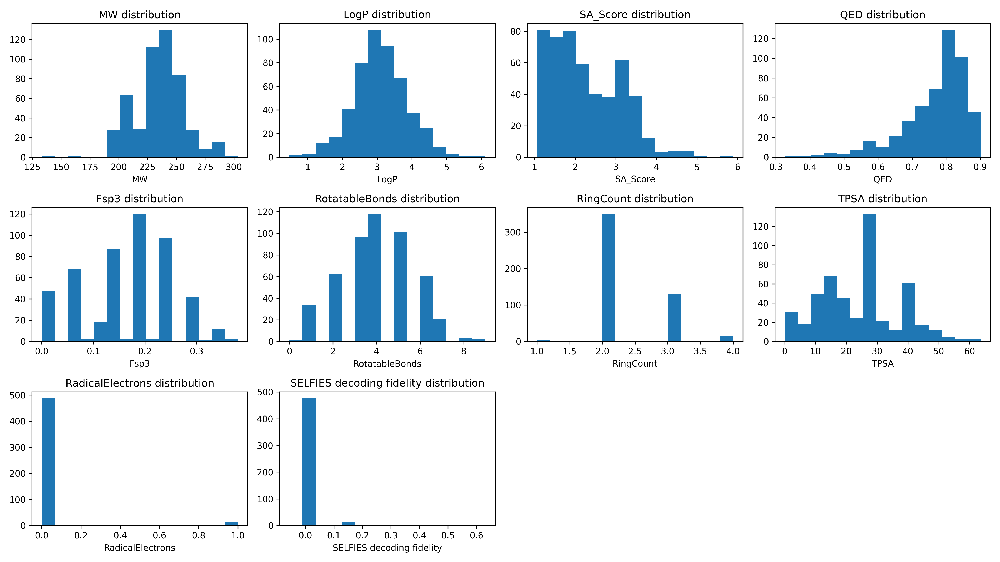

Validation report: bridge_v1
============================

Model: bridge_v1

Samples Generated: 500  

Generated On: 2026-01-04 20:40

Generation Quality Metrics
--------------------------

========== ======= ================
Uniqueness Novelty SELFIES fidelity
========== ======= ================
0.8900     1.0000  0.0083          
========== ======= ================

Descriptor Statistics
---------------------

================ ======== ======== ========
Descriptor       Average  Minimum  Maximum 
================ ======== ======== ========
MW               235.1938 133.1500 303.4500
LogP             3.0860   0.4700   6.1200  
SA_Score         2.2645   1.0600   5.8900  
QED              0.7688   0.3260   0.9020  
Fsp3             0.1675   0.0000   0.3800  
RotatableBonds   3.9620   0.0000   9.0000  
RingCount        2.3200   1.0000   4.0000  
TPSA             24.6952  0.0000   63.6900 
RadicalElectrons 0.0240   0.0000   1.0000  
================ ======== ======== ========

Descriptor Distributions
------------------------

