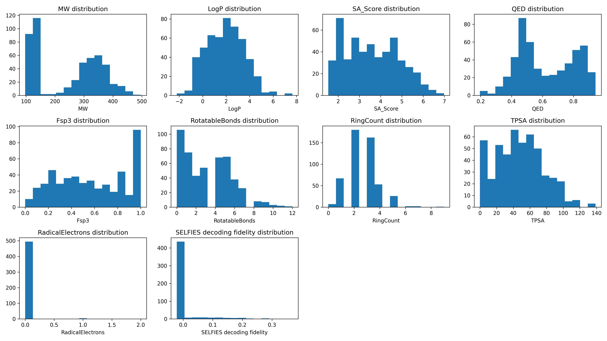

Validation report: extend_v1
============================

Model: extend_v1

Samples Generated: 500  

Generated On: 2026-01-05 00:28

Generation Quality Metrics
--------------------------

========== ======= ================
Uniqueness Novelty SELFIES fidelity
========== ======= ================
0.9960     0.6426  0.0152          
========== ======= ================

Descriptor Statistics
---------------------

================ ======== ======= ========
Descriptor       Average  Minimum Maximum 
================ ======== ======= ========
MW               246.2045 97.1600 496.0100
LogP             1.9321   -2.2100 7.6400  
SA_Score         3.5984   1.5400  6.9800  
QED              0.6220   0.1950  0.9430  
Fsp3             0.5701   0.0000  1.0000  
RotatableBonds   3.0820   0.0000  12.0000 
RingCount        2.5800   0.0000  9.0000  
TPSA             47.8160  0.0000  138.8300
RadicalElectrons 0.0120   0.0000  2.0000  
================ ======== ======= ========

Descriptor Distributions
------------------------

