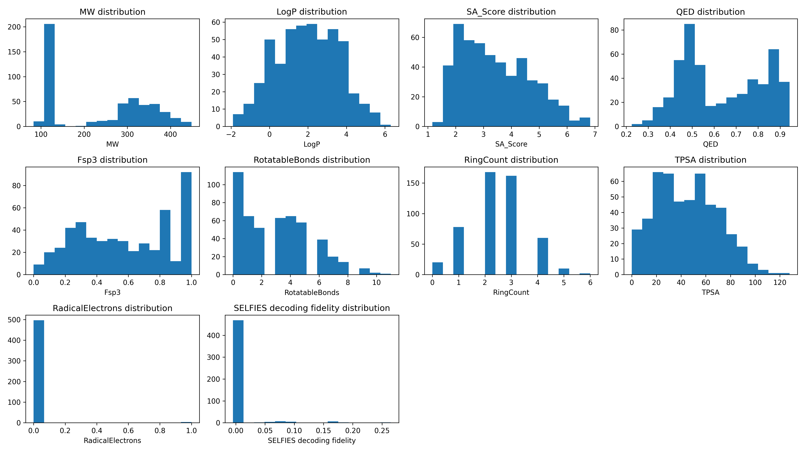

Validation report: extend_v2
============================

Model: extend_v2

Samples Generated: 500  

Generated On: 2026-01-04 20:40

Generation Quality Metrics
--------------------------

========== ======= ================
Uniqueness Novelty SELFIES fidelity
========== ======= ================
1.0000     0.9920  0.0077          
========== ======= ================

Descriptor Statistics
---------------------

================ ======== ======= ========
Descriptor       Average  Minimum Maximum 
================ ======== ======= ========
MW               238.5955 83.0900 448.3600
LogP             1.9655   -1.9000 6.3100  
SA_Score         3.4320   1.1600  6.8300  
QED              0.6327   0.2250  0.9430  
Fsp3             0.5788   0.0000  1.0000  
RotatableBonds   2.9760   0.0000  11.0000 
RingCount        2.4040   0.0000  6.0000  
TPSA             44.7686  0.0000  127.8700
RadicalElectrons 0.0060   0.0000  1.0000  
================ ======== ======= ========

Descriptor Distributions
------------------------

Development Notes
------------------------

The model was trained using SELFIES representations generated from randomized SMILES strings. 
The training corpus was derived from the QM9 and ZINC datasets. 
Randomization was applied at every data access by converting each SMILES string into a non-canonical, randomly ordered form before encoding it into SELFIES.

Training was stopped once the loss reached a clear plateau, even after lowering the learning rate to 1e-5. 
Compared to training on canonical (non-randomized) SMILES, convergence was slower. This behavior is expected, as the same molecule can appear in different randomized forms across batches, increasing input variability and reducing batch-to-batch consistency.

A key challenge introduced by SMILES randomization is vocabulary stability. Because SELFIES are generated on the fly for each batch, new symbols may appear that were not present when the stoi mapping was originally constructed. 
This can result in index errors during tokenization if the mapping is incomplete. Multiple runs through the dataset to get a more complete stoi mapping may be needed or update the stoi on the fly during the pipeline.

PyTorch dataset was defined as follows:

.. code::

   class ChempleterRandomisedSmilesDataset(Dataset):
      """
      PyTorch Dataset for SELFIES molecular representations.

      :param smiles_file: Path to CSV file containing SMILES strings in a "smiles" column.
      :type smiles_file: str
      :param stoi_file: Path to JSON file mapping SELFIES symbols to integer tokens.
      :type stoi_file: str
      :returns: Integer tensor representation of tokenized molecule with dtype=torch.long.
      :rtype: torch.Tensor
      """

      def __init__(self, smiles_file, stoi_file):
         super().__init__()
         smiles_dataframe = pd.read_csv(smiles_file)
         self.data = smiles_dataframe["smiles"].to_list()
         with open(stoi_file) as f:
               self.selfies_to_integer = json.load(f)

      def __len__(self):
         return len(self.data)

      def __getitem__(self, index):
         molecule_in_smiles = self.data[index]

         # try randomisation
         molecule = Chem.MolFromSmiles(molecule_in_smiles)
         if molecule is not None:
               try:
                  molecule_in_selfies = sf.encoder(
                     Chem.MolToSmiles(molecule, canonical=False, doRandom=True)
                  )
               except Exception as e:
                  logger.error(f"SELFIES encoding error for randomised SMILES: {e}")
         else:
               molecule_in_selfies = sf.encoder(molecule_in_smiles)

         symbols_molecule = (
               ["[START]"] + list(sf.split_selfies(molecule_in_selfies)) + ["[END]"]
         )
         integer_molecule = []

         # check if all symbols exist in stoi
         for symbol in symbols_molecule:
               if symbol not in self.selfies_to_integer:
                  raise RuntimeError(
                     f"Molecule symbol not found in stoi. Add {symbol} in stoi with correct integer mapping."
                  )
               else:
                  integer_molecule.append(self.selfies_to_integer[symbol])

         return torch.tensor(integer_molecule, dtype=torch.long)
   
